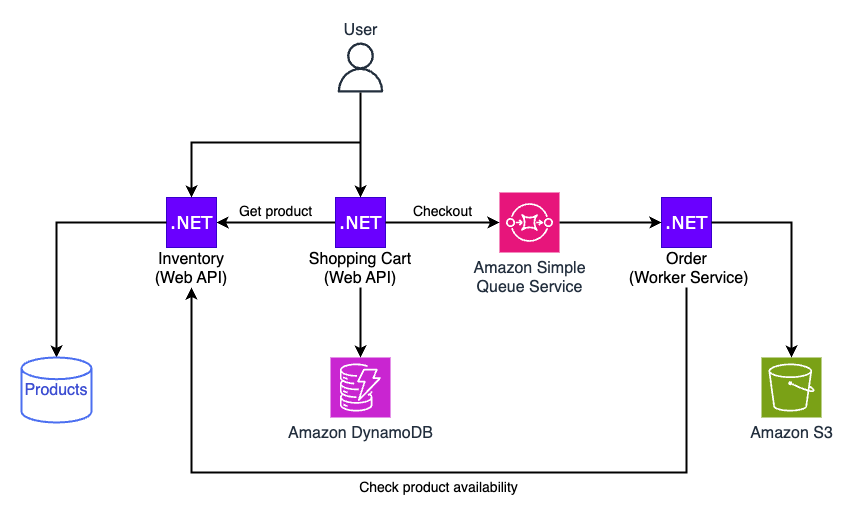

## .NET Microservices Test Samples
This repository contains a sample of how to test an ASP.NET Core micro-service architecture that have external dependencies including AWS services.

The application is built out of two microservices:
- [Inventory service](./src/InventoryService/) used to manage products and stores product data in NoSql data store (MongoDB)
- [Shopping cart service](./src/ShoppingCartService/) used by shoppers to add items to their shopping cart and checkout these items. the shopping cart service uses [Amazon DynamoDB](https://aws.amazon.com/dynamodb/) to store data and [Amazon Simple Queue Service (SQS)](https://aws.amazon.com/sqs/) to send orders for additional processing.

## Architecture


## Project Structure
The solution is split into multiple projects, each service has it's source code, unit and integration tests and service level acceptance tests.

### Inventory
- [InventoryService](./src/InventoryService/) - Inventory service source code
- [InventoryService.Contracts](/src/InventoryService.Contracts/) - classes for communicating with service
- [InventoryServiceTests](/src/InventoryServiceTests/) - Unit and integration tests
- [InventoryServiceAcceptanceTests](/src/InventoryServiceAcceptanceTests/) - Service tests
### Shopping cart
- [ShoppingCartService](./src/ShoppingCartService/) - Shopping cart service source code
- [ShoppingCartServiceTests](/src/ShoppingCartServiceTests/) - Unit and integration tests
- [ShoppingCartServiceAcceptanceTests](./src/ShoppingCartServiceAcceptanceTests/) - service tests
### Other
- [OrderService.Contracts](./src/OrderService.Contracts/) - message definitions for order processing service(s)
- [Common.TestUtils](./src/Common.TestUtils/) - utilities for test initialization and assertions

## Automated Tests
The source code for this sample includes automated unit, integration and service tests. [NUnit](https://nunit.org/) is the test framework used to write these tests. A few other libraries and frameworks are used depending on the test type. Please see below.

### Unit Tests
The goal of these tests is test the service business logic. External dependencies are faked using [FakeItEasy](https://fakeiteasy.github.io/) with [Autofac.Extras.FakeItEasy](https://github.com/autofac/Autofac.Extras.FakeItEasy) as automocking container.
#### [InventoryServiceUnitTests.cs](./src/InventoryServiceTests/Controllers/InventoryServiceUnitTests.cs)
The goal of these unit tests is to test the service business logic [FakeItEasy](https://fakeiteasy.github.io/) is used to fake ```IProductRepository``` interface that is implemented by ```ProductRepository``` that is used to access the service database.
```C#
[Test]
public void AddProductToInventory_ValidData_SaveProductInDb()
{
    var fakeRepository = AutoFake.Resolve<IProductRepository>();
    A.CallTo(() => fakeRepository.Create(A<Product>._))
        .Returns(new Product { Id = "product-1" });

    var target = AutoFake.Resolve<InventoryController>();

    var result = target.AddToInventory(new CreateProductDto("product name", 1));

    Assert.That(result.Result, Is.InstanceOf<CreatedAtRouteResult>());
    var cartId = ((CreatedAtRouteResult)result.Result!)?.RouteValues?["id"]?.ToString();
    Assert.That(cartId, Is.EqualTo("product-1"));
}
```
#### [ShoppingCartControllerUnitTests.cs](./src/ShoppingCartServiceTests/Controllers/ShoppingCartControllerUnitTests.cs)
The goal of these unit tests is to test the service business logic [FakeItEasy](https://fakeiteasy.github.io/) is used to fake the following:
- ```IShoppingCartRepository``` interface that is implemented by ```ShoppingCartRepository``` that is used to access the service database (DynamoDB).
- ```IInventoryRepository``` interface that is implemented by ```InventoryRepository``` that is used to call the inventory service using http.
- ```IOrderServiceNotifications``` interface that is used by ```OrderServiceNotifications``` that implements asynchronous messaging using Amazon SQS.
```C#
[Test]
public async Task Checkout_ShoppingCartFound_SendDataInQueue()
{
    var fakeShoppingCartRepository = AutoFake.Resolve<IShoppingCartRepository>();
    var fakeOrderServiceNotifications = AutoFake.Resolve<IOrderServiceNotifications>();

    var shippingAddress = new ShippingAddress
    {
        Name = "Customer name",
        Country = "Country-1",
        City = "City-1",
        Street = "Street-1"
    };

    A.CallTo(() => fakeShoppingCartRepository.FindByIdAsync(A<string>._))
        .Returns(Task.FromResult<ShoppingCartDo?>(new ShoppingCartDo
        {
            Id = "cart-1",
            Items = new List<string> { "item-1", "item-2" },
            ShippingAddress = shippingAddress
        }));

    var target = AutoFake.Resolve<ShoppingCartController>();

    await target.Checkout("cart-1");

    A.CallTo(() =>
            fakeOrderServiceNotifications.SendOrder(
                A<IEnumerable<string>>
                    .That.IsSameSequenceAs(new[] { "item-1", "item-2" }),
                shippingAddress))
        .MustHaveHappened();
}
```
### Integration Tests
These tests are used to test interaction between the services and 3rd party external dependencies. Test fixture are used to initialize and cleanup external dependencies in ```*TestBase.cs``` files:
- [MongoDbTestBase](./src/InventoryServiceTests/MongoDbTestBase.cs) - initialize MongoDB inside Docker container for testing.
- [DynamoDBTestBase](./src/ShoppingCartServiceTests/DynamoDBTestBase.cs) - initialize [DynamoDB Local](https://docs.aws.amazon.com/amazondynamodb/latest/developerguide/DynamoDBLocal.html) inside Docker container for testing.
- [SqsTestBase](./src/ShoppingCartServiceTests/SqsTestBase.cs) - Create SQS Queue in AWS for testing and cleanup after test run.

The different integration tests fixture use inheritance to add the needed external dependencies and NUnit for test execution

#### ProductRepositoryIntegrationTests.cs
```C#
public class ProductRepositoryIntegrationTests : MongoDbTestBase
{
    [Test]
    public void FindAll_HasTwoProductsInDB_ReturnAllProducts()
    {
        var target = new ProductRepository(GetDatabaseSettings());

        var product1 = new Product { Name = "name-1", Quantity = 1, Price = 10 };
        target.Create(product1);

        var product2 = new Product { Name = "name-2", Quantity = 2, Price = 20 };
        target.Create(product2);

        var actual = target.FindAll().ToList();

        var expected = new List<Product> { product1, product2 };
        Assert.That(actual, Is.EqualTo(expected));
    }
```
### Service Tests
Service tests purpose is to test the service level requirements of your system. (SpecFlow)[https://specflow.org/] a BDD framework for .NET is used to avoid unreadable tests and help make the test readable even for non-technical members of the team.
"Tests" are built using feature files:
####[Products.feature](./src/InventoryServiceAcceptanceTests/Features/Products.feature)
```Gherkin
Scenario: Update product quantity
    Given a product "product 1" with price 100 and quantity 10 is in the inventory
    When user update product quantity to 20
    Then that product is found in repository with name "product 1" price 100 and quantity 20
```
The code in ***StepDefinition** files implement the different steps:
```C#
#### [ProductStepDefinitions.cs](./src/InventoryServiceAcceptanceTests/Steps/ProductStepDefinitions.cs)
[When(@"user update product quantity to (.*)")]
public async Task WhenUserUpdateProductQuantityTo(int quantity)
{
    await _testServerDriver.UpdateQuantity(_lastAddedProductId!, quantity);
}
```

#### Using fake http server
In addition [WireMock.NET](https://github.com/WireMock-Net/WireMock.Net) is used to fake http calls to other services, for example shopping cart service needs to call inventory service. Inside the test we initialize and then set the behavior or a fake server to return the response needed by the specific test
####[InventoryServiceDriver.cs](./src/ShoppingCartServiceAcceptanceTests/Drivers/InventoryServiceDriver.cs)
```C#
public class InventoryServiceDriver: IDisposable
{
    private readonly WireMockServer _server = WireMockServer.Start();
    
    public string MockProviderServiceBaseUri => _server.Urls[0];
    
    . . .

    public void SetProductAsMissing(string productId)
    {
        _server.Given(Request.Create().WithPath($"/api/inventory/{productId}"))
            .RespondWith(
                Response.Create()
                    .WithStatusCode(404));
    }
```

## Running The Tests
Running the tests can be done using your IDE or from the command line using ```dotnet test -m:1```. 
> [!NOTE]
> using *-m:1* disable parallel test run, due to a known bug running test in parallel in some OSs cause the test run to freeze at the end of the run.

Running the integration and service tests requires [Docker](https://docs.docker.com/desktop/) to be installed on your machine.

## Security

See [CONTRIBUTING](CONTRIBUTING.md#security-issue-notifications) for more information.

## License

This library is licensed under the MIT-0 License. See the LICENSE file.

